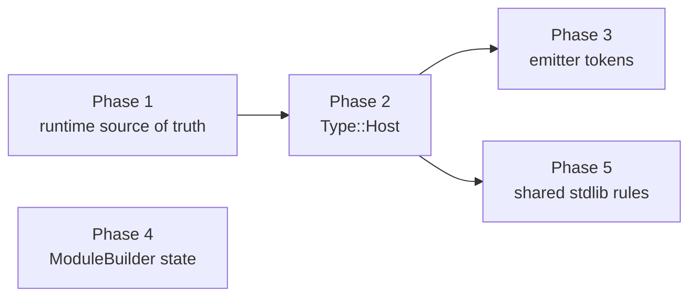

# Smelt architecture plan — the second pass

Measured 2026-08-19 on `claude/estoolkit-utilities-wxhb0t` @ `d07be02`.
Successor to `docs/architecture-review.html` (2026-06-04).

## Thesis

The 2026-06 review's recommendations landed unevenly, and the pattern is
legible: **every item with a single seam to build got built; every item that
required moving state or a source-of-truth did not.**

`ModuleBuilder` went from 98 fields to 63 and from 18 numbered files to 33
concern-named ones — the files were regrouped, the god object was not dissolved.
Meanwhile the entire generated runtime (106 symbols, 1,695 `writer.line(...)`
calls, 6,431 lines injected into every generated crate) is still Rust source
held as string literals inside Rust, and `smelt-runtime` remains a nine-line
empty placeholder.

So this pass moves the three things the last one couldn't: **the runtime's
source of truth, the type lattice, and `ModuleBuilder`'s state** — in that
order, because each unblocks the feature work queued behind it.

## 0 · Scoring the 2026-06 review

| # | Recommendation | Verdict | Evidence today |
| --- | --- | --- | --- |
| 2 | Concentrate `SmeltUnknown` into one coercion seam | **Landed** | `emitter/coercion.rs`, 2,500 lines, is the seam; `RenderedValue` began a typed follow-on |
| 3 | One expression emitter — stop writing it twice | **Landed** | `list_query.rs` 1,764 → 771 lines; `callback_expr` now referenced from one file |
| 6 | Drive MIR validation from the `Rvalue` algebra | **Landed** | `for_each_operand` / `for_each_operand_mut` in `validate/operands.rs` |
| 1 | A stdlib-lowering registry behind one seam | **Half** | The registry captured *recognition*, not *lowering* — see finding E |
| 4 | Split `ModuleBuilder` by concern | **Files only** | 63 fields, 944 methods, one `impl` across 33 files — see finding C |
| 5 | Make emitted source the test surface | **Barely** | `insta` is a dev-dependency with 25 snapshots, against 1,867 surviving `.contains()` assertions |

Three landed, one half, one files-only, one barely started.

## 1 · Where the code actually is

| Crate | Lines | Files |
| --- | ---: | ---: |
| `smelt-frontend-ts` | 88,420 | 74 |
| `smelt-codegen-rust` | 60,845 | 71 |
| `smelt-frontend-py` | 20,593 | 46 |
| `smelt-mir` | 13,795 | 21 |
| `smelt-transpiler` | 9,614 | 20 |
| `smelt-hir` | 5,991 | 25 |
| `smelt-specialize` | 5,296 | 11 |
| `smelt-stdlib` | 2,054 | 11 |
| `smelt-runtime` | **9** | 1 |

Largest source files: `codegen-rust/src/lib.rs` 4,600 · `frontend-ts/lowering/stdlib/call_dispatch.rs`
4,570 · `codegen-rust/emitter/core.rs` 4,385 · `frontend-ts/lowering/expr/operators.rs` 3,869.

Other load-bearing numbers: `Type` has 20 variants; `Rvalue` has 176.
`FunctionEmitter` carries 16 fields (6 of them `RefCell`) and 585 methods across
27 files. Inline tests account for 45,791 lines inside the two big crates
(27,016 + 18,775) — which is why `CLAUDE.md`'s tight loop is `--lib`.

Corpora at this commit: es-toolkit 875/184 (82.6%), remeda 1789/0, radash 3
pre-existing compile errors. es-toolkit avoidable erasure 35,738 against a
35,677 baseline (+61, documented and un-laundered).

## 2 · Findings

Lettered, not numbered — these are independent, not a sequence. The sequence is
section 3.

### A · The runtime is a string literal

106 runtime symbols are emitted by 1,695 `writer.line(...)` calls spread over
four modules (`lib.rs` 1,450 · `byte_buffer_prelude.rs` 167 ·
`reflection_prelude.rs` 54 · `thrown.rs` 23). For es-toolkit that is 6,431
lines of prelude prepended to a 746-file generated crate.

**What it costs today.** The runtime is never type-checked, clippy'd, rustfmt'd
or unit-tested on its own terms. Its only test surface is *emit a whole crate
and `cargo test` it* — which is exactly what `tests/class_identity_runtime.rs`
and `tests/typed_array_runtime.rs` do, at roughly 30 seconds per case, gated
behind `#[ignore]`. Every representation change therefore pays crate-emission
latency to learn whether a ten-line helper is correct. That is the real reason
representation work (`SmeltUnknown`, `SmeltArray` identity, byte-buffer views)
is so expensive: the architecture is written as text.

**What is already right.** ~15 `needs_*` predicates computed from the MIR
already decide which helpers to emit. The *selection* machinery is sound; only
the source form is wrong.

**Proposal.** Move the source of truth into `smelt-runtime` as real, compiled,
tested Rust, and keep emitting it inline. The emitter reads the runtime's own
modules and selects items by name, driven by a manifest that maps each `needs_*`
gate to the items it requires; a build-time check asserts every gate resolves.
Generated crates stay self-contained — no version skew, no user-facing
dependency. Turning it into an actual dependency is a *later, separate*
decision that needs a stable ABI, and the ABI is still moving.

**Payoff.** Runtime bugs become millisecond unit tests instead of 30-second
crate emissions; `SmeltList` reference semantics and byte-buffer views get a
real test bed; clippy and rustfmt start covering 6,431 lines they have never
seen.

### STATUS 2026-08-19 — first increment landed, and the phase is not divisible

Five families moved (`value.rs` with `SmeltList` and object-id minting,
`clock.rs`, `captures.rs`, `uri.rs`): 11 named item regions, 119 `writer.line`
calls removed, 863 lines of real tested Rust in `smelt-runtime`, and 27 unit
tests that run in ~0.01s. Emitted bytes verified unchanged — regenerating
es-toolkit recompiled **zero** of its 746 files, and the prelude md5 is identical.

**The important finding is why the rest did not move.** The runtime cannot be
extracted family by family. Roughly **1,193 of the ~1,577 `writer.line` calls
are the `needs_unknown` value core** — `SmeltUnknown`, `SmeltObject`,
`SmeltArray`, `SmeltRecord`, `SmeltJsMap`/`SmeltJsSet`, truthiness,
`Object.prototype.toString` tags, `smelt_for_in_record_keys`, function identity,
`smelt_class_constructor`, structured clone, generators, vitest mocks, the timer
queue — and every one of those items references `SmeltUnknown`/`SmeltObject`/
`SmeltArray`, so none of them compiles in `smelt-runtime` until the value core
moves. `byte_buffer_prelude.rs`, `reflection_prelude.rs`, `thrown.rs`, the host
override and the regexp block all sit behind that same wall.

So Phase 1 is **one indivisible value-core move, then a cheap tail** — not a
gradual family-by-family migration. What landed is precisely the subset with no
dependency on the value core, which is what made a byte-identical first
increment possible at all. The exit criterion "≥1 unit test per emitted symbol
family" is therefore unreachable incrementally; it becomes meaningful only after
the value core lands.

The mechanism is reusable as-is: helpers are marked `// @smelt:item <name>` in
the runtime source, `smelt_runtime::source` returns each region as a byte slice
of the real file (so emitted bytes *are* the bytes on disk), and
`runtime_prelude.rs` maps each existing `needs_*` gate to its item names, with a
test that walks every gate × item and reports all missing pairs at once.

`smelt-runtime` deliberately does not take `[lints] workspace = true`:
`clippy::all` stays **deny** (correctness, suspicious, style, complexity, perf —
the lints that find real bugs), while `pedantic`/`nursery` drop to warnings
because satisfying them would edit emitted text. Two `clippy::all` members
(`type_complexity`, `clone_on_ref_ptr`) are allowed for the same reason and are
real deferred cleanups belonging to a deliberate byte-changing commit.

### B · The type lattice cannot name a host object

`Type` has 20 variants. `JsMap` exists *solely* to preserve a source spelling,
and its doc comment is the precedent for what follows. What is missing is any
variant that names a host object: `Buffer`, `ArrayBuffer`, `DataView` and the
eleven typed-array views are all `Type::Unknown`.

**What it costs today.** The typed-array work pushed avoidable erasure to
35,738 (+61). The dominant shape is
`smelt_reflected_construct("uint8array", …)` emitted for a literal
`new Uint8Array([0, 1, 2, …])` — a statically known class routed through the
dynamic boundary because the lattice has nothing else to say.

**Why the cheap fix fails.** Typing the construction `Dict(String, Unknown)` —
the record it already is at runtime — aborts the es-toolkit build at
`compat/object/clone.ts:99` with "Map.set requires key and value arguments":
`destView.set(srcView)` is `Uint8Array.prototype.set`, but a `Dict` receiver
dispatches it as `Map.set`, because `Dict` is deliberately shared between
source `Map` and source `Record`.

**Proposal.** `Type::Host { class: HostClass }`, backed by the existing
`smelt_stdlib::host_object` registry — a registry-index newtype rather than a
`Symbol`, so the 30 match arms that gain the variant do not each re-look-up a
name. First cut is deliberately narrow: the **15 registry entries carrying
`byte_buffer: Some(_)`** (`ArrayBuffer`, `SharedArrayBuffer`, the eleven views,
Node `Buffer`, `DataView`) and nothing else. Boxed primitives already build a
typed `Dict(String, Unknown)` with an explicit `UnknownCast`; `RegExp` has
`SmeltRegExp`; `Date`, `Error`, `Blob`/`File` and `Proxy` have working dedicated
paths a `Host` type would disturb. Marker-only entries (`WeakMap`, `Request`,
eight `Intl.*`) carry no debt and are the natural second cut.

**The variant is the enabler, not the lever — do not implement it expecting the
number to fall.** `host_construct_text`
(`emitter/host_interop.rs:88-91`) erases *every* argument through
`self.erase(arg)` into `vec![SmeltUnknown…]` regardless of destination type;
`dest_ty` only affects the outer conversion. So retyping the destination leaves
the dominant line's token count exactly where it is. What moves the metric is
the **typed constructor door**: 137 non-prelude construct sites carry 179
avoidable tokens, 150 of them *inside* that argument erasure. `Type::Host` is
what lets the frontend select a form-specific constructor from the argument's
own HIR type (length / element-list / view-over-storage / dynamic), keeping
`smelt_reflected_construct` only for a genuinely runtime-known class. A
`type SmeltHostRecord = …` alias would erase ~140 tokens textually and is
relabelling — explicitly rejected.

**Two zero-copy adapters are required, not optional.** `IntoSmeltUnknown for
SmeltRecord` and `SmeltFromUnknown for SmeltRecord` both *rebuild* the top-level
field map (same `id`, fresh `Rc`), while `SmeltObject::from_unknown_record`
shares it. Byte-buffer semantics depend on in-place write-through, so the `Host`
erase must use the sharing adapter and a `SmeltRecord::from_unknown_object` must
be added for the reverse. No string golden can catch this — only the `#[ignore]`d
runtime tier can.

**Payoff.** Retires the ratchet debt at its source instead of relabelling it,
makes the `Uint8Array.prototype.set` / `Map.set` collision structurally
impossible (a `Host` receiver matches none of `Dict`/`JsMap`/`Set` at
`stdlib/collections.rs:74-76` and falls to `_ => return Ok(None)`), and is the
change that most directly serves the "what a skilled team would hand-write" bar.

Full site inventory, scope argument, staged checkpoints and regression tests:
`blocker-logs/phase2-type-host-spec.md`.

### C · `ModuleBuilder`'s state was never split

63 fields, 944 methods, one `impl` spread across 33 files. Any method may mutate
any field.

**What it costs today**, concretely and from this week: adding module-scope
constructor-function lowering required a new field
(`module_constructor_functions`) that must be read by
`predeclare_function_item` *and* unioned into `pending_class_names`. That is a
three-way invariant with nothing to enforce it and no way to test it in
isolation.

**Proposal.** Extract cohesive sub-states as owned structs, one concern at a
time — `ClassRegistry` (classes, class_fields, class_methods, class_bases,
pending_class_names, scoped_class_type_names, module_constructor_functions),
`LocalScope`, `TypeScope`, `TestScaffold`, `ModuleGlobals`. `ModuleBuilder`
keeps its shape and its methods; each extraction moves one field group behind a
small struct with named operations, so the invariant above becomes a method on
`ClassRegistry` rather than a convention.

Deliberately not a rewrite, and deliberately late in the sequence: every step is
independently shippable, and none of it is blocking feature work.

### STATUS 2026-08-19 — DONE, 63 → 25 fields

Seven extractions, one commit each, 42 fields collapsed into 7 owned structs
under `lowering/state/`: `ClassRegistry`, `LocalScope`, `InterfaceRegistry`,
`TypeScope`, `ConstRegistry`, `ImportScope`, `FunctionRegistry`. All sub-fields
private; every use site goes through a named operation. All three corpora
unchanged (es-toolkit 875/184, remeda 1789/0, radash 3 pre-existing), workspace
suite green, no test weakened.

The class-registry invariant is now enforced by construction:
`ClassRegistry::declare_module_scope(declared, constructor_functions)` is the
*only* writer of both `pending_names` and `constructor_functions`, both private,
and it unions them in one call — so "recorded as a constructor function but not
pending" is unrepresentable. The third leg reads the same private set through the
single `is_constructor_function`, which both the predeclaration skip and the
synthesis dispatch call, so they cannot disagree.

Four groupings in the sketch above did not survive contact with the code, and the
corrections are worth keeping: `class_index_values` belongs to the class group;
`TestScaffold` is not a group (`test_builtins` is its only field, and it landed
in `ImportScope`); `ModuleGlobals` was left alone at net −2 because a consumer
takes the map by `&mut`; and **`LocalScope` is not one frame** — the five
per-body groups are taken in genuinely different subsets at each of the nesting
sites, so a single `enter_body()` would have changed behaviour. Each group keeps
its own `take_*`/`restore_*` returning a distinct opaque frame type, so a frame
can only go back where it came from.

The remaining margin is the 9-field body cursor (`current_class`,
`current_async`, `current_return_ty`, …), which would reach ~17 but has the same
per-site-subset problem and no invariant to enforce — only a rename of ~150 read
sites. Left deliberately.

### D · The emitter still passes Rust as `String`

284 distinct `*_text` functions. `RenderedValue` — text plus `TypeId` plus
`Precedence` — is adopted in 4 of 31 emitter modules; its own module comment
says so ("the rest of the emitter still threads bare strings").

The proof that the representation has hit its ceiling is
`emitter/rendered_text_rewrite.rs`: a mini-lexer over *already-rendered Rust*
that performs shadow-aware identifier substitution while carefully avoiding
struct-field positions, path segments, and string literals.

**Proposal.** Two routes. Finish `RenderedValue` everywhere (incremental, no
new dependencies), or emit `proc_macro2::TokenStream` via `quote` and print with
`prettyplease`. `CLAUDE.md` prefers well-known libraries over custom machinery,
and the second route deletes `rendered_text_rewrite.rs` and the precedence
question outright — hygiene stops being the emitter's problem.

**Recommendation.** Do not start with a wholesale `quote` migration. Do it
behind the coercion seam first, which already speaks `RenderedValue`, measure,
then decide. Sequenced after B because B removes erased paths and shrinks the
surface to migrate.

### E · Two frontends, two copies of stdlib knowledge

`smelt-stdlib` is 2,054 lines of tables and names. The TypeScript stdlib
lowering is 11,752 lines; Python's is 1,941 in its own `stdlib*.rs` set. The
shared crate holds *what things are called*; each frontend independently holds
*what they lower to*. This is why review item #1 scores "half".

**Cost.** A fix to `Array.prototype.*` semantics in TypeScript does not reach
Python, and vice versa.

**Proposal.** Move the *rule* — argument shapes to HIR construction — into
`smelt-stdlib` for the families where both frontends already agree: collections
first (List / Dict / Set), then string operations, then Math / Number. Language-
specific spelling stays in the frontends.

Sequenced last: it is the largest item, the least urgent, and much cheaper once
B gives it a shared type lattice to build against.

## 3 · Sequence

| Phase | Finding | Unblocks | Blast radius | Exit criterion |
| ---: | --- | --- | --- | --- |
| 1 | A | All representation work | `codegen-rust/src/*prelude*`, `smelt-runtime` | Corpora byte-identical after `@smelt:prelude-end`; ≥1 unit test per emitted symbol family in `smelt-runtime` |
| 2 | B | Typed arrays, the ratchet, host method dispatch | `smelt-hir/ty.rs`, 30 exhaustive `Type` matches, 240 erased-receiver gates, constructor doors | es-toolkit avoidable ≤ 35,677 with typed arrays retained; `Uint8Array.prototype.set` dispatches without the `Map` collision; corpora ≥ current |
| 3 | D | Emitter correctness at scale | `codegen-rust/emitter/*` | `rendered_text_rewrite.rs` deleted; `*_text` count under 50 |
| 4 | C | Frontend feature velocity | `frontend-ts/lowering/*` | ~~`ModuleBuilder` at ≤ 25 direct fields; class-registry invariant enforced by construction~~ **DONE 2026-08-19** |
| 5 | E | Python/TypeScript parity | `smelt-stdlib`, both frontends | One rule table drives collections in both frontends; both regression suites unchanged |

**Phase 2 staging.** The spec stages it so each step is falsifiable:
(0) registry plumbing, corpora untouched; (1) variant plus 30 arms with nothing
producing it, prelude **byte-identical**; (2) produce it behind a total
erase-on-use fallback, avoidable **flat ±30** — a swing over 50 means the
fallback is not total, so revert rather than patch; (3) typed constructor doors,
where the metric is expected to move −100 to −150; (4) dispatch fix plus
`instanceof` static folding, corpora *above* current because
`clone.ts:99` currently no-ops; (5) re-snapshot the baseline in the same commit.
The 240 erased-receiver gates matching `Some(Type::Unknown` cannot be sized
without compiling — stage 2's flat-corpus gate is the mitigation.

**On timing.** `CLAUDE.md` says to finish active feature phases before broad
division refactors. Phases 1 and 2 are not that refactor — they are feature
enablement for the 99% TS/Py goal, and the ratchet debt in finding B is already
blocking. Phases 3–5 *are* the deliberate pass and should wait for the current
feature phase to stabilise.

## 4 · Non-goals for this pass

- **Dependency-izing `smelt-runtime`.** The generated ABI is still moving —
  `SmeltList` reference semantics and byte-buffer views are both in flight.
  Phase 1 moves the source of truth only.
- **A test-surface sweep.** The 45,791 inline test lines and 1,867
  `.contains()` assertions are worth converting, but as part of whichever phase
  touches them, not as a separate project.
- **A MIR redesign.** `Rvalue` at 176 variants is large, but the operand algebra
  landed and validation walks it generically.
- **`smelt-gui`, `smelt-py-ty-spike`, `smelt-asyncio`.** Out of scope.
